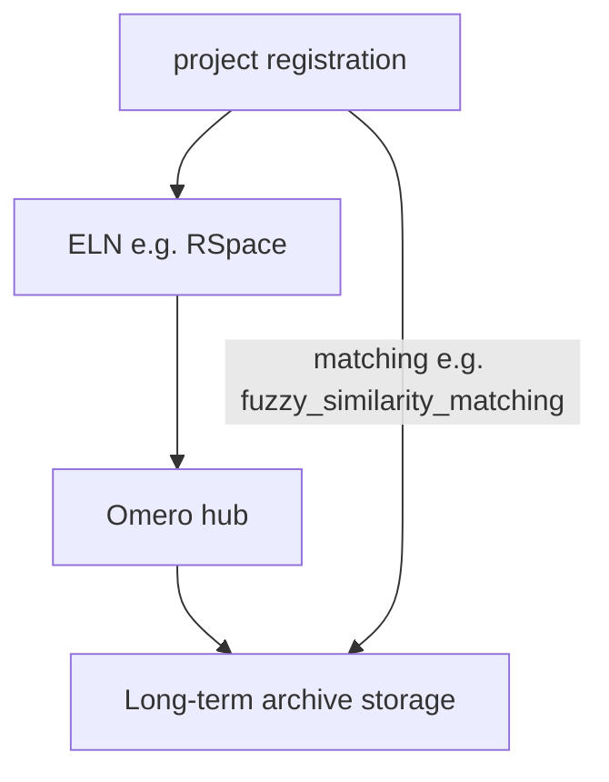

# RDM_system_connector
# **WARNING** 
This is a proof of concept, it has not been decided whether it will be developed into a fully functional tool. 
Feedback is therefore essential, especially as it is unclear whether this type of tool is useful at all, and if so, which parts, as the concept consists of many different parts.
(source code readme: 
- [installation guide and short description](/docs/src_README.md)
- [sphinx code documentation](/docs/_build/html/index.html)

---

# Table of Contents:
- [RDM\_system\_connector](#rdm_system_connector)
- [**WARNING**](#warning)
- [Table of Contents:](#table-of-contents)
- [RDM system connector](#rdm-system-connector)
			- [overview graph](#overview-graph)
	- [Internal project study registration](#internal-project-study-registration)
	- [ELN (e.g. RSpace, elabFTW) \& inventory](#eln-eg-rspace-elabftw--inventory)
	- [Omero Image \& metadata hub](#omero-image--metadata-hub)
	- [long-term archive storage](#long-term-archive-storage)
	- [matching](#matching)
	- [(fuzzy similarity matching, direct matching, manual\_linking)](#fuzzy-similarity-matching-direct-matching-manual_linking)
- [long-term vision](#long-term-vision)
	- [of a connected RDM \_structure](#of-a-connected-rdm-_structure)
# RDM system connector

- The purpose of this tool will be to connect different platforms that have been or will be used as part of research data management. 
- Every part of the system is replaceable as the connection is the central point of the tool. 
- the benefits in day-to-day research result from the cooperation of different stakeholders who work together on a project and do not necessarily have access to the same systems or do not use them in their work process despite having access
- making essential information usable in all connected systems makes it possible to have it available more quickly and clearly
- in the best case scenario, stakeholders receive information that they were previously unable to obtain
[see a real practical example](practical%20example%20lin.md)

#### overview graph

## Internal project study registration
- the main point of this part is that every scientific project has a study registration somewhere
- the registration can be a proposal (e.g. a pdf/text file to apply for a funding programme or a thesis)
- we use a separate platform (egroupware) where people can register their study and book time slots for specific instruments (e.g. MR, EEG, microscopes, computer servers)
## ELN (e.g. RSpace, elabFTW) & inventory
- a platform where protocols of preparation procedures or plans for procedures can be written
- there should be basic protocols and subject-specific ones (e.g. keeping track of daily events)
- be used to plan and structure the interaction between people working on different parts of a project (e.g. principal investigators set the protocol and delegate work; technical assistants prepare the tissue; doctoral candidates take the images). 

## Omero Image & metadata hub
- use inplace import to link the images from [long-term_archive_storage](#long-term archive storage) to Omero
- use key-value pairs to display the metadata
- create tags from [(semi-)automatic tag creation](/docs/(semi-)%20automatic%20tag%20creation.md) including tag descriptions from [(semi-)_automatic_description&_ontology_linking_creation](/docs/(semi-)%20automatic%20description%20&%20ontology%20linking%20creation.md)
## long-term archive storage
- crawl a mounted drive to find images, metadata files, projects, studies and add them to [ELN_(e.g._RSpace,_elabFTW)_+_inventory](#ELN%20(e.g.%20RSpace,%20elabFTW)%20&%20inventory) and [Omero_Image_+_metadata_hub](#Omero%20Image%20&%20metadata%20hub)
- use file names, folder names, metadata for [(semi-)_automatic_tag_creation](/docs/(semi-)%20automatic%20tag%20creation.md) and [(semi-)_automatic_description_&_ontology_linking_creation](/docs/(semi-)%20automatic%20description%20&%20ontology%20linking%20creation.md)
## matching 
## (fuzzy similarity matching, direct matching, manual_linking)
- **fuzzy** = Calculate the overlap of project names (from [internal_project_study_registration](#internal%20project%20study%20registration) and folder names (from [long-term_archive_storage](#long-term%20archive%20storage)); 
	- where a percentage of overlap of consecutive letters is specified; if the shortest name (either projectname or foldername) is completely contained in the other (~one is the substring of the other), by convention the overlap is set to 100% 
- TODO: **direct matching** = define a file (TODO: metadata entry) Define a file or a metadata entry from a file as the project name, which must be identical to that of the study application, character for character; i.e. a 100% match is assumed
	- e.g. our project leaders have to sign an application letter which is included in [internal_project_study_registration](#internal%20project%20study%20registration) and in [long-term_archive_storage](#long-term%20archive%20storage) for every new project or study. 
	- as both files are identical, the project duration, project manager and project name can be read from them
- TODO: **manual linking** = the linking table in the database could be filled manually to force a specific project/study to be linked to another;  
	- however, a browser interface is planned to display the automatically generated matches, validate them by eye and create your own

# long-term vision
## of a connected RDM _structure
