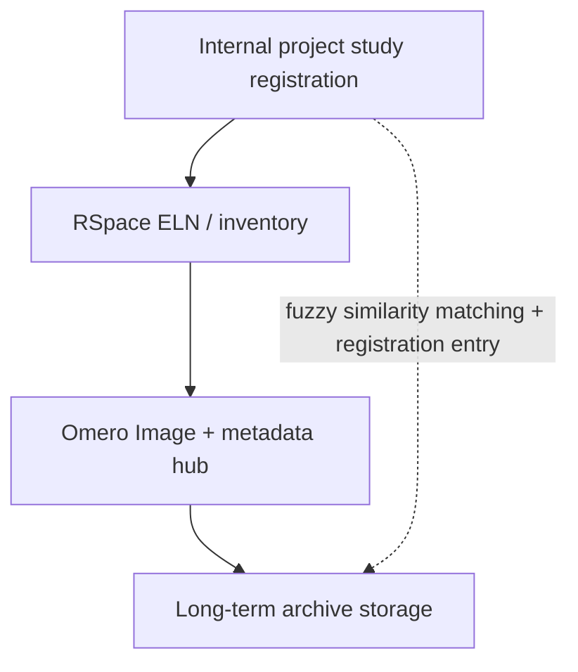

# RDM_system_connector

this tool is intended to link different research data management platforms with each other

```mermaid
graph TD
    A[Internal project study registration] --> B[RSpace ELN / inventory]
    B --> C[Omero Image + metadata hub]
    C --> D[Long-term archive storage]

    A -.->|fuzzy similarity matching + registration entry| D
```

## Internal project study registration
- the idea is that every scientific project got a study registration anywhere anyhow
- the registration could be a proposal (e.g. a pdf/ textfile to apply for funding programm or a thesis)
- we use a separate plattform (egroupware) where people can register their study and book timeslots for particular instruments (e.g. MR, EEG, microscopes, computing servers)
## ELN (e.g. RSpace, elabFTW) + inventory
- a plattform where to write protocols of preparation procedures or plans for procedures
- there're should be base protocols and subject specific applied onces (e.g. keep track of daily happenings)
- being used to plan and structure the interaction between people working on different parts in a project (e.g. principle investigators sets the protocol and delegates the work; technical assistants prepair the tissue; doctoral student takes the pictures) 

## Omero Image + metadata hub
- after reg