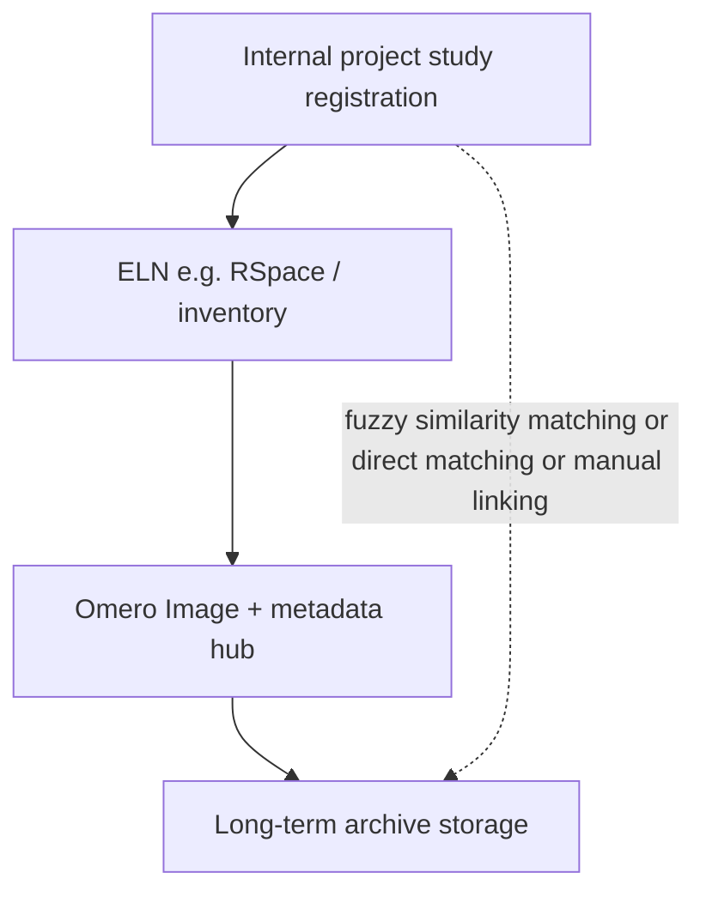

# **WARNING** 
this is a proof-of-concept it has not been decided whether it will be finalised into a fully executable tool. 
Therefore feedback is essential, especially as it is unclear whether this type of tool is useful at all and if so which parts, as the concept consists of many different parts.

---

# RDM_system_connector

this tool is intended to link different research data management platforms with each other

```mermaid
graph TD
    A[Internal project study registration] --> B[ELN e.g. RSpace / inventory]
    B --> C[Omero Image + metadata hub]
    C --> D[Long-term archive storage]

    A -.->|fuzzy similarity matching or direct matching or manual linking| D
```

## Internal project study registration
- the idea is that every scientific project got a study registration anywhere anyhow
- the registration could be a proposal (e.g. a pdf/ textfile to apply for funding programm or a thesis)
- we use a separate plattform (egroupware) where people can register their study and book timeslots for particular instruments (e.g. MR, EEG, microscopes, computing servers)
## ELN (e.g. RSpace, elabFTW) + inventory
- a plattform where to write protocols of preparation procedures or plans for procedures
- there're should be base protocols and subject specific applied onces (e.g. keep track of daily happenings)
- being used to plan and structure the interaction between people working on different parts in a project (e.g. principle investigators sets the protocol and delegates the work; technical assistants prepair the tissue; doctoral student takes the pictures) 

## Omero Image + metadata hub
- use inplace import to link the images from [[## Long-term archive storage]] into omero
- use key-value pairs to show the metadata
- create tag's from the [[## (semi-) automatic tag creation]] including tag descriptions from [[## (semi-) automatic description and ontology linking creation]]

## fuzzy similarity matching or direct matching or manual linking
- **fuzzy** = calculate the overlap of project names (from [[## Internal project study registration]] and foldernames (from [[## Long-term archive storage]]); 
	- where a percentage of overlap of consecutive letters is specified. if the shortest name (either projectname or foldername) is completely contained in the other, set the overlap to 100% by convention
- TODO: **direct matching** = define a file (TODO: metadata entry) define a file or a metadata entry from a file as the project name which must be identical character for character with that of the study application; i.e. a 100% match is assumed as given
	- e.g. our project leaders have to sign a application letter which is included in [[## Internal project study registration]] and in every new project or study to come in [[## Long-term archive storage]] 
	- since both files are identical, the project execution time span, the project leader and the project name can be read from them
- TODO: **manual linking** = the linking table in the database could be filled manually to force a specific project/ study to be matched to another one;  
	- however, a browser interface is planned to display the automatically determined matches, eye validate them and create your own
## Long-term archive storage
- crawl a mounted drive to find images, metadata-files, projects, studies to add it into [[## ELN (e.g. RSpace, elabFTW) + inventory]] and [[## Omero Image + metadata hub]]
- use filenames, foldernames, metadata for  [[## (semi-) automatic tag creation]] and [[## (semi-) automatic description and ontology linking creation]]
## (semi-) automatic tag creation
- parse filenames, foldernames (TODO: metadata) to create possible tag's for a specific project (or TODO: study/ image) and save it to a json file
- TODO: augment the tag's using LLM to write out abbreviations and translate to english 

## (semi-) automatic description and ontology linking creation
- TODO: use LLM to create descriptions for the augmented tag's [[## (semi-) automatic tag creation]]
- TODO: use descriptions and tag's to find a matching ontology entry using [Ontology lookup service v4 (OLS4)](https://www.ebi.ac.uk/ols4)