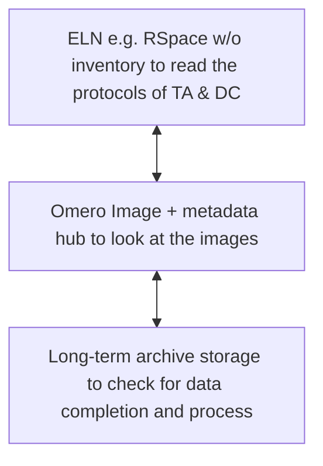
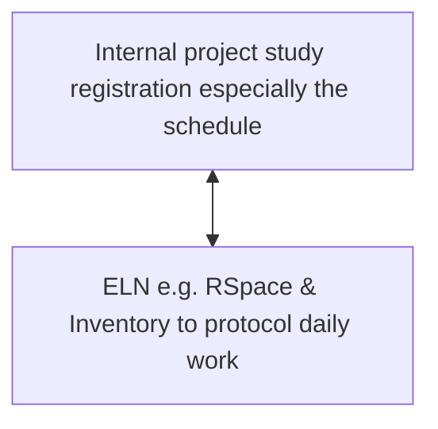
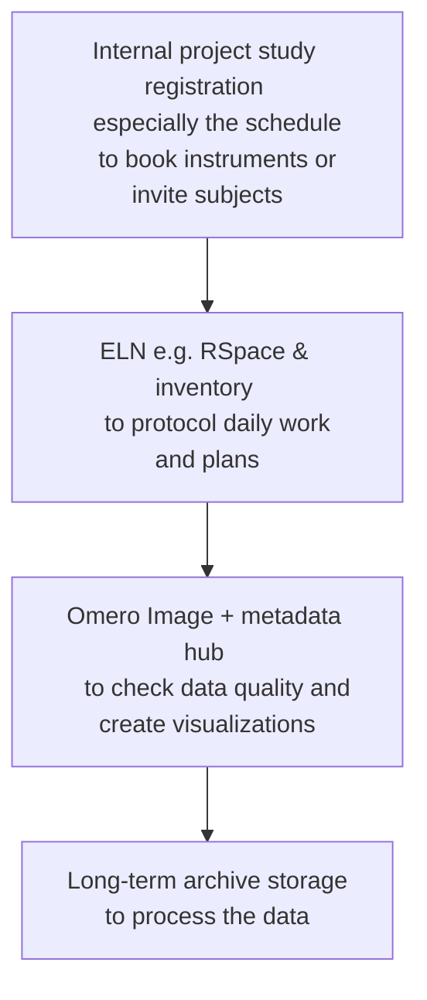

- three different individuals are working on the same study (based on a project)
	- PI (principle investigator; e.g. leader of the working group)
	- TA (technical assistant; e.g. staff member usually not scientist or without scientific expertise)
	- DC (doctoral candidate; e.g. usually the person who has the most knowledge about this particular study)

- PI usually uses in his daily work:

- TA usually uses:

- DC usually uses:

- PI: after linking he sees 
	- in the [ELN](README.md#ELN_(e.g._RSpace,_elabFTW)_+_inventory) that the DC has scanned images and can view them with the [link to omero](README.md#Omero_Image_+_metadata_hub); 
	- asking ‘how the aquise is running’ ([project registration schedule](README.md#Internal_project_study_registration)) or whether all data has already been recorded ([omero](README.md#Omero_Image_+_metadata_hub)) is unnecessary, 
	- as is counting the data records on the [long-term storage](README.md#long-term_archive_storage).
- TA: sees
	- can see if images have already been scanned [ELN](README.md#ELN_(e.g._RSpace,_elabFTW)_+_inventory)
	- can see when new subjects will arrive or working will be necessary ([project registration schedule](README.md#Internal_project_study_registration))
	- can follow what the study is about and how analysis is progressing [ELN](README.md#ELN_(e.g._RSpace,_elabFTW)_+_inventory)
- DC: 
	- can immediately recognise whether a TA's work is ready to start taking pictures [ELN](README.md#ELN_(e.g._RSpace,_elabFTW)_+_inventory)
	- the linking of [omero](README.md#Omero_Image_+_metadata_hub) and [long-term storage](README.md#long-term_archive_storage) makes it possible 
		- to get the absolute links to the data very quickly, even if there are a lot of files on the network drive and the display of the paths would take too long, 
		- links are also arranged subject-specifically and it can be iterated over the data of all subjects for group analyses without searching for the files on the network storage

